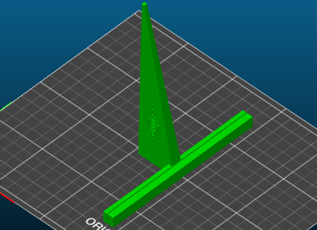

Aufsteller
===

Dieser Aufsteller wurde entwickelt zur Präsentation von gebastelten Objekten. Der Aufsteller hält die Beschreibung des Objekts.

Der Aufsteller ist gedacht für ein laminiertes DIN A5 Papier, das unten in den Schlitz gesteckt wird und es dann aufrecht hält.

Seitlich eingeprägt ist das Logo des DARC.

Downloads:

* [Aufsteller.blend](Aufsteller.blend), 967 kB
* [Aufsteller.stl](Aufsteller.stl), 448 kB

