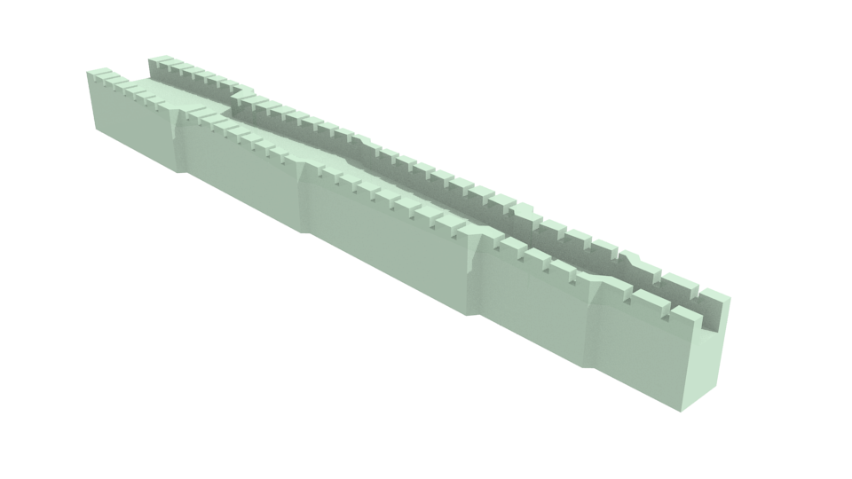

Biegelehre
===

Eine Biegelehre, auch Abbiegevorrichtung, wird für bedrahtete Bauteile benötigt, um sie im Rastermaß von 2,54mm zu biegen. Jeder Jugendliche, der sein Elektroniklabor ausstatten möchte, sollte eine Biegelehre in seine Liste aufnehmen.

Preisvergleich:

 * 3D-Druck in PETG (nachts leuchtend) für 0,58 €.
 * bei [Pollin](https://www.pollin.de/p/abbiegevorrichtung-fuer-bauteile-442567) für 0,93 €.
 * bei [Reichelt](https://www.reichelt.de/biegelehre-zum-abknicken-von-bauteilen-biegelehre-p5595.html?r=1) für 0,99 €.
 * bei [Conrad](https://www.conrad.de/de/abbiegevorrichtung-kemo-inhalt-1-st-425869.html) für 3,19 €.

Die Farben variieren, Reichelt liefert derzeit wohl in schwarz, Pollin in blau und Conrad in rot. Wir haben sie auch schon in gelb gesehen. Im 3D-Druck stehen Euch alle Farben zur Verfügung, die ihr an Filament zur Verfügung habt.

Kosten im 3D-Selbstdruck: der Verbrauch liegt bei 12,0g Filament. Die Druckdauer beträgt auf dem Prusa i3 MK3 (0,2mm) etwa 1 Stunde. Bei beheizter Grundplatte (90°C) kostet alles zusammen etwa 0,58 € (kWh-Preis von 0,27€ angenommen).

Downloads:

* [Biegelehre.blend](Biegelehre.blend), 521 kB
* [Biegelehre.stl](Biegelehre.stl), 70 kB

